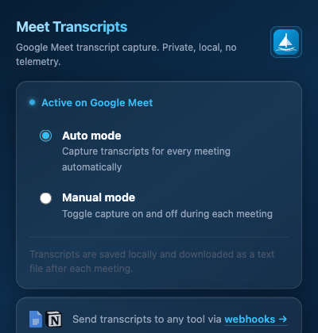
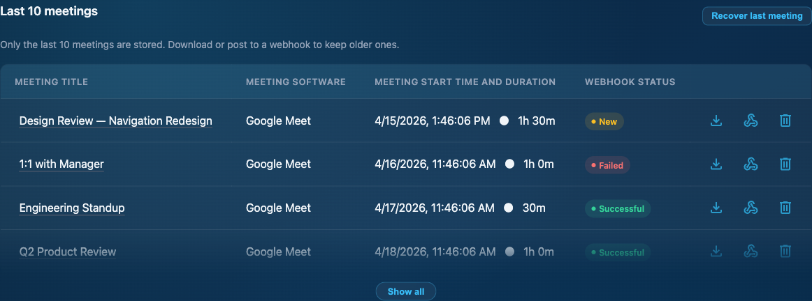
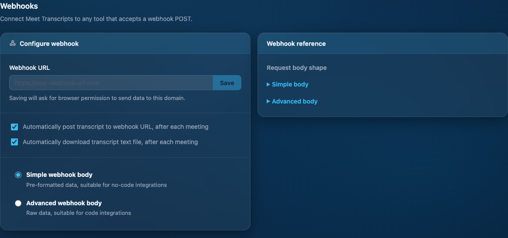

# Meet Transcripts

A Chrome extension that captures Google Meet transcripts locally in your browser and saves them as `.txt` files at the end of each meeting.

Installed as an unpacked extension — not published to the Chrome Web Store. Private, local, no telemetry.

---

## Screenshots

<table>
  <tr>
    <td align="center"><strong>Popup</strong></td>
    <td align="center"><strong>Meeting history</strong></td>
    <td align="center"><strong>Webhook config</strong></td>
  </tr>
  <tr>
    <td></td>
    <td></td>
    <td></td>
  </tr>
</table>

---

## What it does

Meet Transcripts runs in the background during Google Meet calls. It reads the live captions and assembles a transcript locally in the browser. At the end of each meeting:

- Downloads the transcript as a `.txt` file
- Optionally POSTs it to a configured webhook (Google Docs, Notion, or any HTTP endpoint)

All processing stays in the browser. Nothing leaves the device unless you explicitly configure a webhook.

---

## Installation

This extension is installed in Chrome as an unpacked extension. It requires **developer mode** enabled.

1. Clone or download this repository
2. Open Chrome and go to `chrome://extensions`
3. Enable **Developer mode** (toggle in the top-right corner)
4. Click **Load unpacked**
5. Select the `extension/` folder from this repository
6. The Meet Transcripts icon will appear in your Chrome toolbar

To update: pull the latest `main`, then click the refresh icon on the extension card at `chrome://extensions`.

---

## Usage

The extension has two modes:

- **Auto mode** — records transcripts for every meeting automatically
- **Manual mode** — toggle capture on and off during each meeting via the extension popup

At the end of a meeting the transcript is downloaded as a `.txt` file. Open the extension popup to view the last 10 meetings or configure a webhook.

---

## Webhook integration

Pipe transcripts to any tool that accepts a webhook POST. Configure the URL in the extension's webhooks page (`meetings.html`). Supports both a simple pre-formatted body and a raw advanced body for code integrations.

---

## Docs

- [Architecture](docs/architecture.md) — extension internals
- [ADR-001](docs/decisions/ADR-001-fork-and-maintenance-strategy.md) — product history and decisions

---

## Contributing

See [CONTRIBUTING.md](CONTRIBUTING.md).

---

## License

MIT. See [LICENSE](LICENSE).
