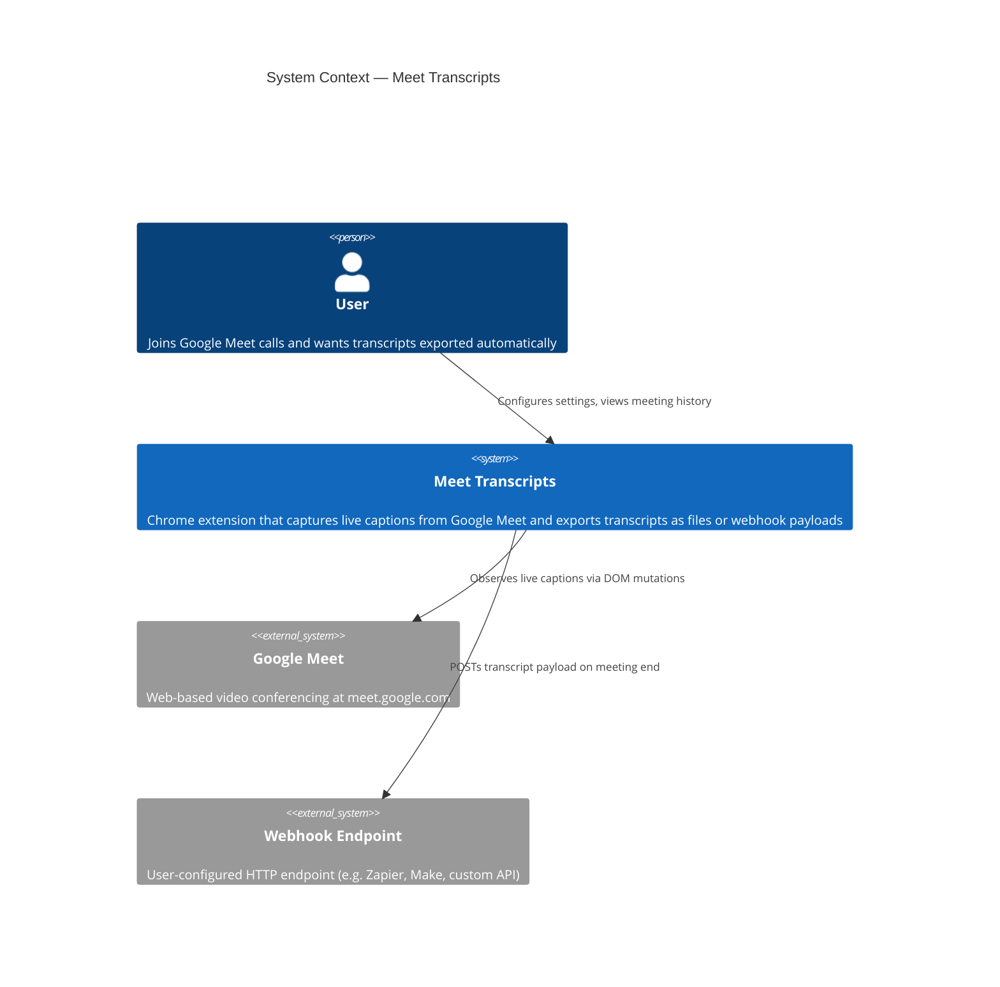
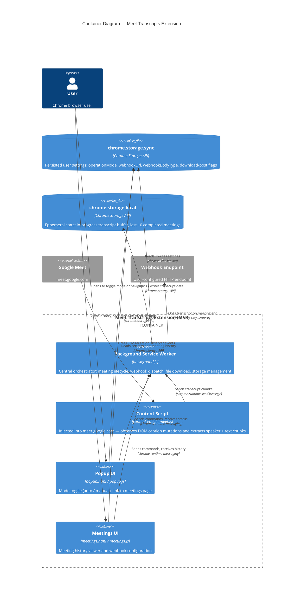
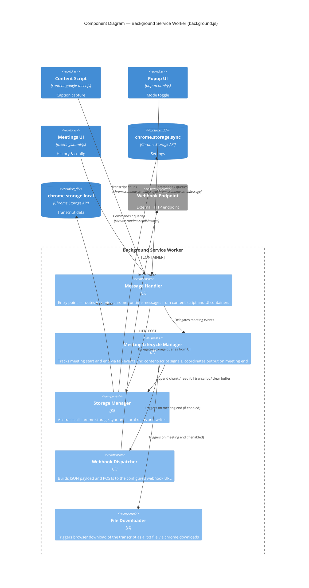
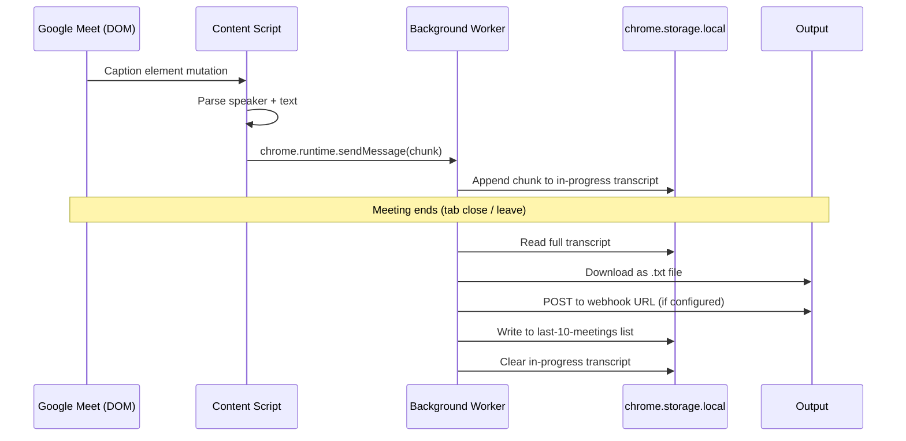
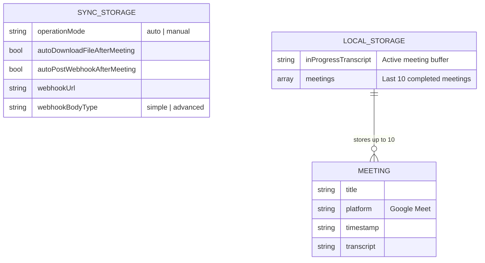

# Architecture

This document describes the architecture of the Meet Transcripts Chrome extension using the [C4 model](https://c4model.com/).

---

## Level 1 — System Context

Who uses the system and what external systems does it interact with.

---

## Level 2 — Container

The internal containers (deployable/runnable units) inside the extension.

---

## Level 3 — Component (Background Service Worker)

Internal components of the central orchestrator.

---

## Data flow — transcript capture to output

---

## Storage model

---

## Key files reference

| File | Role |
|------|------|
| `extension/manifest.json` | Extension metadata, permissions, host matches |
| `extension/background.js` | Service worker — central orchestrator |
| `extension/content-google-meet.js` | Google Meet DOM observer and transcript capture |
| `extension/popup.html/js` | Extension popup UI |
| `extension/meetings.html/js` | Meeting history and webhook configuration UI |
| `types/index.js` | JSDoc type definitions |
| `docs/decisions/` | Architecture decision records |
